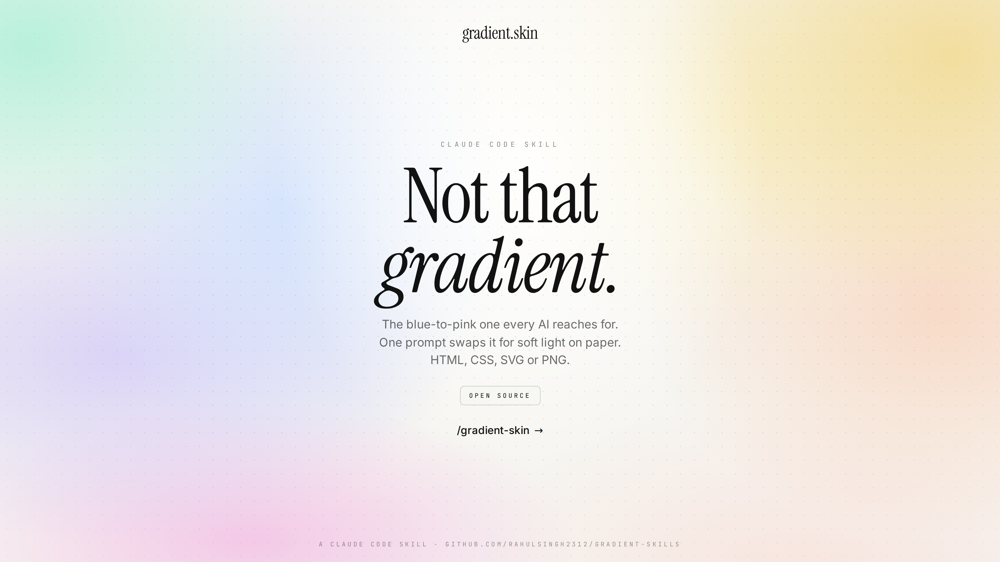
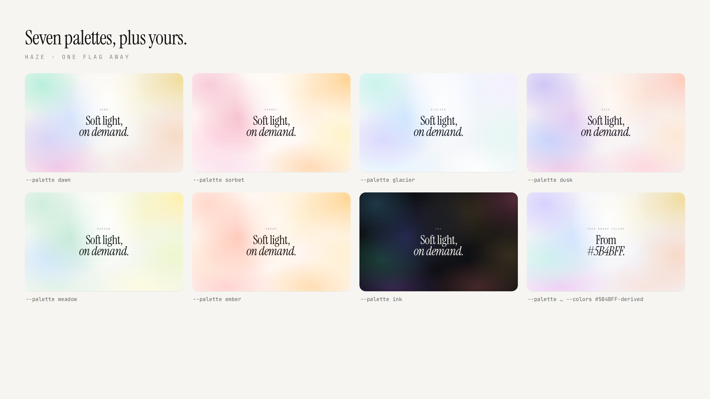

# gradient-skills

Claude Code skills for gradients. Currently one: **gradient.skin**.

<p align="center"></p>

## gradient.skin

Soft pastel "mesh" gradient backgrounds and editorial hero sections: blurred colour blobs, a white
light-leak, a faint dot grid, optional grain, and serif display type with an italic second line.
One prompt gives you HTML, CSS, SVG, or PNG.

<p align="center"></p>

### Install

```bash
curl -fsSL gradient.skin/install | sh                 # → ~/.claude/skills/gradient-skin
curl -fsSL gradient.skin/install | sh -s -- --project  # → ./.claude/skills/gradient-skin
```

The installer sends one anonymous event so installs can be counted — no personal data, nothing stored
on your machine. Skip it with `GRADIENT_SKIN_NO_ANALYTICS=1`.

Or `gradient.skin/skill` downloads the packaged `.skill` file (drop it into Claude, the card shows a
**Save skill** button). From source: clone this repo and copy `gradient-skin/` into `~/.claude/skills/`.

Then in Claude Code:

```
/gradient-skin launch hero, palette meadow, animated, export OG + X images
```

### Use the script directly

```bash
python3 gradient-skin/scripts/skin.py --palette sorbet --seed 4 --headline "Launch" --italic "day." --out og.png
python3 gradient-skin/scripts/skin.py --blank --palette dusk --format css   # CSS to stdout
python3 gradient-skin/scripts/skin.py --responsive --out hero.html          # standalone page
```

Pure standard-library Python. PNG export needs Node + Playwright once:
`npm i -g playwright && npx playwright install chromium`. HTML, CSS, and SVG need nothing.

Palettes: 16 light (`dawn` `sorbet` `glacier` `dusk` `meadow` `ember` `peach` `lilac` `ocean` `citrus` `rose` `sand` `mint` `aurora` `candy` `slate`), 4 dark (`ink` `midnight` `graphite` `nightfall`), `--dark` for a dark twin of any, `--from-brand #hex` to derive one, or `--colors` with your own.
Add `--animate` and the blobs drift slowly, like light on water.
Layouts: `split` `corners` `wash` `halo`. See `gradient-skin/SKILL.md` for the full set of flags and the design
rules, `gradient-skin/references/recipe.md` for hand-writing it into React/Tailwind.

### Repo layout

```
gradient-skin/            the skill (SKILL.md, scripts/, references/, assets/fonts/)
gradient-skin.skill       packaged skill, importable into Claude
launch/          X posts, domain shortlist, launch images and the spec that made them
site/            landing page (index.html + og.png); `python3 site/build.py` regenerates it from the skill
```

## License

MIT for the code and docs. Bundled fonts (Instrument Serif, Inter, JetBrains Mono) are under the
SIL Open Font License, see `gradient-skin/assets/fonts/OFL.txt`.
